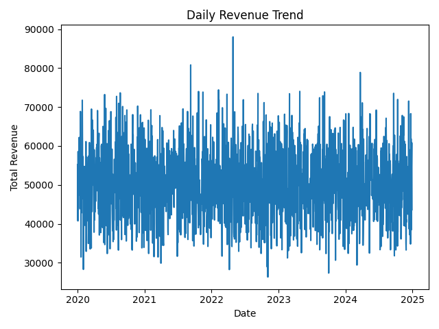
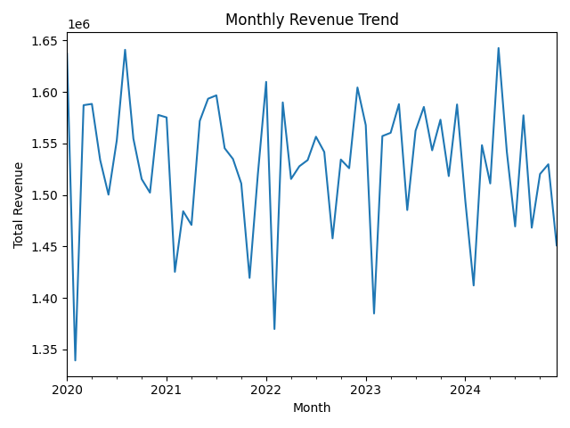
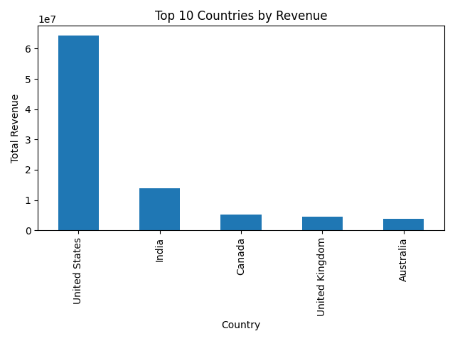
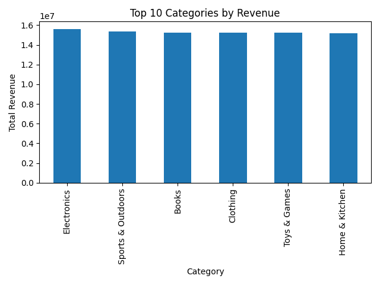
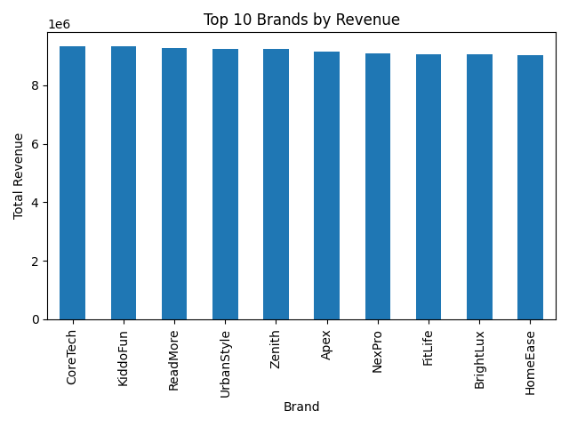
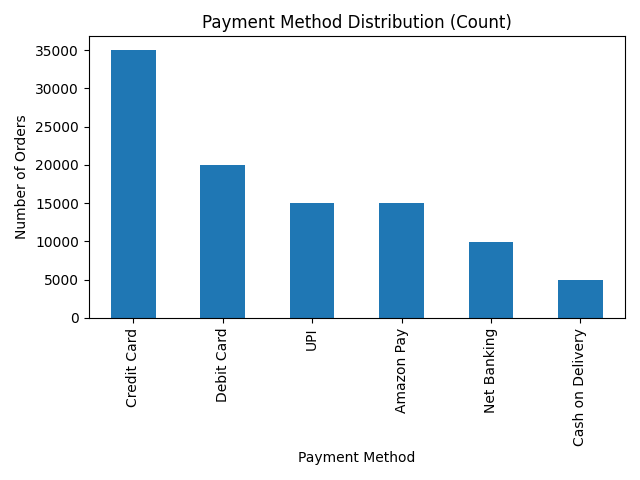
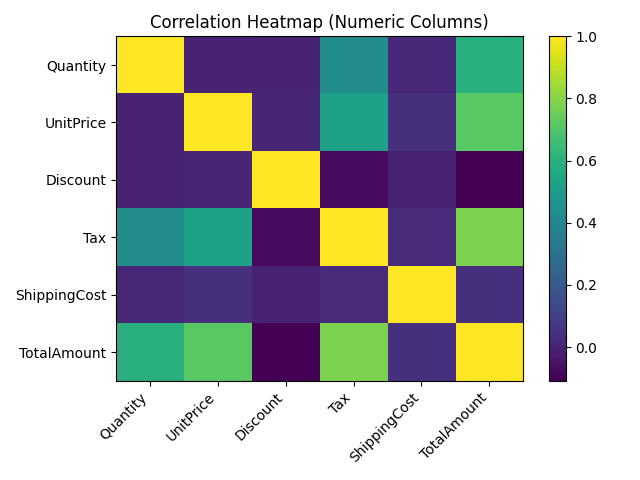

# 🚀 Amazon Sales Analytics Engine

---

```markdown
# Description

A modular, SQL-powered business intelligence project that transforms raw transactional data into structured executive insights.

Built with Python, SQLite, and a KPI-driven analytical framework.

---

## Executive KPI Summary

Analyzed 100,000 transactions to evaluate revenue performance, growth trends, concentration risk, and customer retention.

**Key Metrics**

|              Metric                  | Value            |
|--------------------------------------|------------------|
| **Total Revenue**                    | $91,825,647.92   |
| **Total Orders**                     | 100,000          |
| **Average Order Value (AOV)**        | $918.26          |
| **Latest Monthly Growth**            | -5.15%           |
| **Revenue Concentration (Top 20%)**  | 20.73%           |
| **Top Category Revenue Share**       | 16.97%           |
| **Repeat Customer Rate**             | 68.70%           |  

---

## Strategic Observations

- Revenue distribution is diversified across products and categories.
- Concentration risk is limited (no extreme product dominance).
- High repeat customer rate indicates strong retention behavior.
- Recent negative monthly growth suggests potential cyclical slowdown.

---

## Technical Highlights

- SQL-based KPI engine
- Modular architecture
- Time-series revenue analysis
- Customer retention analytics
- Revenue concentration modeling
- Reproducible environment setup

---

## Architecture


CSV Data → SQLite Database → SQL KPI Engine → Business Logic Modules → Visualization Layer 
```

## 📊 Visual Outputs

### Revenue Trends



### Revenue Breakdown




### Product & Brand Analysis



### Payment & Correlation



````
## ⚙️ Technical Highlights

- SQL-based KPI aggregation engine
- Revenue concentration modeling (Pareto logic)
- Customer retention analysis
- Time-series growth calculation
- Modular Python architecture
- Reproducible environment setup

---

## Run Locally

```bash
python3 -m venv .venv
source .venv/bin/activate
pip install -r requirements.txt

python src/init_db.py
python src/main.py
````

---

## Author

Han-Pin Hung
Business Analytics & Data Engineering
